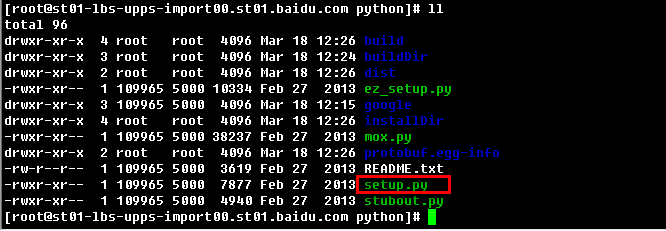
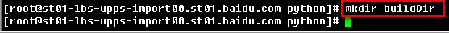
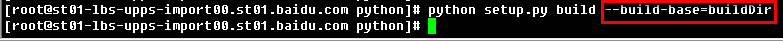
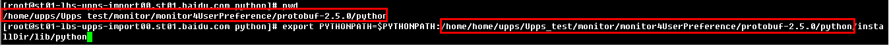
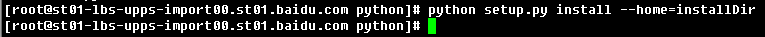
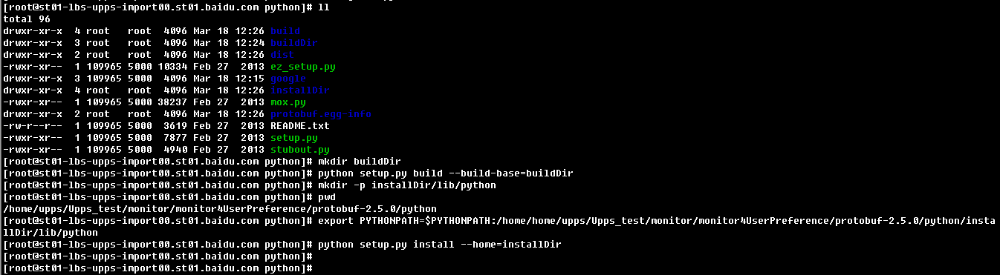

customedInstalling4pythonmodule
===========================    

### Introduction:
an extraordinary practical example for customed installing of python module.

### UpdateRecords:
* 1.0——base version.    

### Screenshots:    
**1.screenshot of module src directory:**    
    

**2.screenshot of creating build directory:**    
    

**3.screenshot of setup.py build:**    
 

**4.screenshot of creating install directory:**    
 

**5.screenshot of exporting PYTHONPATH:**    
     

**6.screenshot of setup.py install:**    
     

**7.screenshot of completed process:**    
   

### Kindly Reminder:
If any questions, please contact JunneYang 597092663@qq.com.

